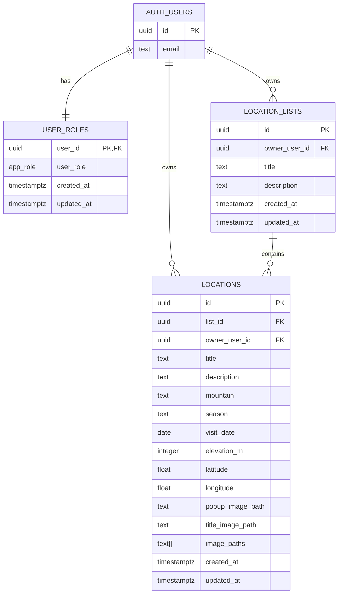

# Map tracking tourism TKX

## Project description
Map tracking tourism TKX is a web app for tracking mountain trips of **ТК Хоро и приятели** on an interactive map.

Main capabilities:
- Browse all locations on Leaflet map and in a side list.
- View trip details (title, mountain, season, visit date, elevation, description, coordinates).
- View popup/title/gallery images per location.
- Add and edit locations based on role permissions.
- Use an admin panel for user and location administration.

Role model (who can do what):
- `visitors`: public read/browse access.
- `publisher`: create/update/delete own location list and own locations.
- `editor`: can update locations per RLS/app rules (including image-related edits in current app flow).
- `admin`: full access + user management via admin panel and RPC functions.

## Architecture
### Front-end
- Vanilla **HTML / CSS / JavaScript**.
- Main app files:
  - `index.html`
  - `styles.css`
  - `app.js`
- Admin app files:
  - `admin/admin.html`
  - `admin/admin.css`
  - `admin/admin.js`

### Back-end
- **Supabase**:
  - Postgres database
  - Supabase Auth
  - Supabase Storage (`location-images` bucket)
  - RLS policies
  - SQL RPC functions for admin operations
- Client SDK: `@supabase/supabase-js` via CDN.

### Database and policy evolution
- SQL migrations are versioned in `supabase/migrations`.
- Migrations define schema, role enum, helper functions, RLS policies, and admin RPC functions.

## Database schema design
Main relational model:

Notes:
- `user_roles.user_role` uses enum `public.app_role` (`visitors`, `publisher`, `editor`, `admin`).
- RLS is enabled on core tables and enforces role-based writes.
- Storage policies allow authenticated access and folder-based path constraints.

## Local development setup guide
### Prerequisites
- VS Code (recommended)
- Supabase project (already used by current app)
- Any static web server (for local run)

### Steps
1. Open project folder in VS Code.
2. Verify Supabase connection constants in:
   - `app.js`
   - `admin/admin.js`
3. Run a local static server from project root, for example:
   - `python -m http.server 5500`
   - or use VS Code Live Server extension.
4. Open:
   - Main app: `http://localhost:5500/index.html`
   - Admin panel: `http://localhost:5500/admin/admin.html`

### Database migrations (when needed)
- Migrations live in `supabase/migrations`.
- Apply them with Supabase CLI (or your current DB workflow) in chronological order.

## Key folders and files
- `index.html` — main UI shell (menu, map container, modal host).
- `app.js` — main app logic (map, auth/session, CRUD, uploads, popups, role-based UI).
- `styles.css` — responsive styles for main app and shared components.
- `admin/admin.html` — admin panel structure.
- `admin/admin.js` — admin data loading, role actions, user/location operations.
- `admin/admin.css` — admin panel styling.
- `supabase/migrations/` — DB schema, RLS, and RPC evolution.
- `scripts/bulk_upload_images_via_function.ps1` — utility script for image upload workflows.
- `Images/` — local source image folders used by trips/locations.
- `.github/coopilot-instruction.md` — project-specific Copilot guidance document.
